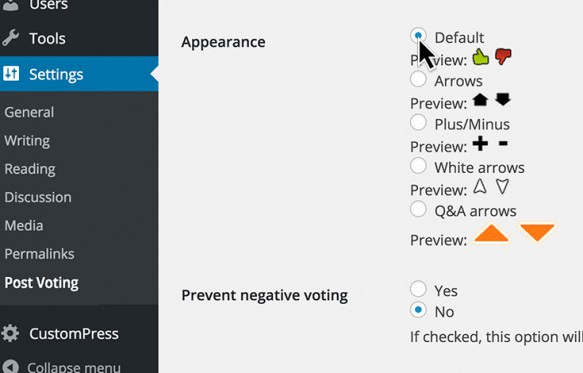
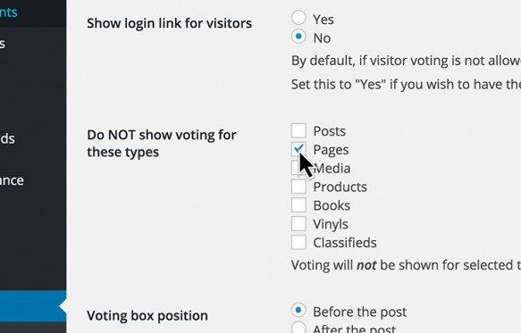
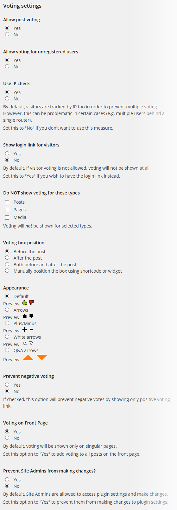
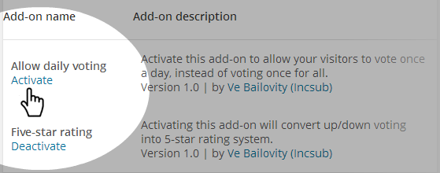
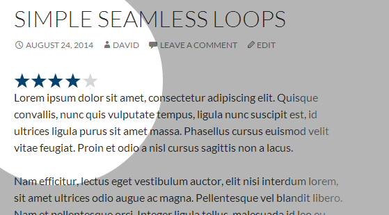
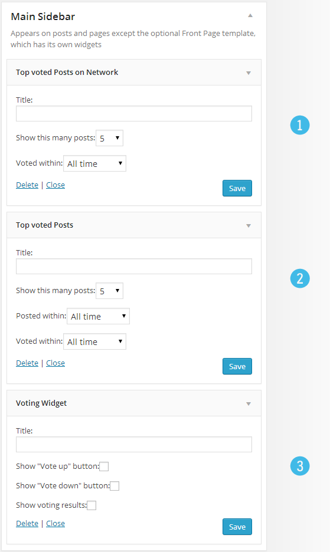

# PS Voting

**Miss die Beliebtheit des Inhalts Deiner Webseite, indem Du Deine Besucher oder Benutzer über diesen Inhalt abstimmen lässt. So ähnlich wie Dein persönliches Digg oder Reddit, und es steckt voller Funktionen!**

[DOWNLOAD](https://github.com/cp-psource/ps-voting/releases) | [FORUM](https://github.com/cp-psource/ps-voting/discussions) | [PROBLEM-MELDEN](https://github.com/cp-psource/ps-voting/issues)

## About

Gibe Benutzern die Möglichkeit, Deinen Inhalten einen „Daumen hoch“ zu geben. Mit dem PS-Voting-Plugin kannst Du die Inhalte verfolgen, die Deine Benutzer lieben... und hassen.

  Füge ClassicPress Digg-Funktionalität hinzu.

### One-Click-Feedback

Erfasse Benutzerfeedback, indem Du sie mit einem Klick abstimmen lasst. Verwende ein einfaches Daumen hoch oder runter, +1 oder 5 Sterne-Bewertungssystem. Verfolge standort- und netzwerkweite Abstimmungen über den im Dashboard enthaltenen Abstimmungsstatistikbildschirm.

### Abstimmung mit Stil

Wähle aus 6 Abstimmungssymbolstilen, die perfekt zum Erscheinungsbild Deiner Webseite passen. Füge automatisch Abstimmungssymbole über oder unter Deinem Beitrag ein oder verwende Shortcodes für die benutzerdefinierte Integration.

  Integriere ein nachverfolgbares 5-Sterne-Bewertungssystem.

### Für Multisite konzipiert

Das PS-Voting-Plugin ist vollständig Multisite-kompatibel, einschließlich globaler Abstimmungsfreigabe, der Möglichkeit, am häufigsten bewertete Beiträge aus Deinem gesamten Netzwerk zu teilen und netzwerkweiter Statistikverfolgung.

  Beschränke die Abstimmung auf die Beitragstypen Deiner Wahl.

### Individuelle Passform

Das PS-Voting-Plugin sieht mit jedem gut codierten ClaasicPress-Theme sofort fantastisch aus. Darüber hinaus bieten unsere vollständige Shortcode-Bibliothek und drei integrierte Widgets eine einfache Möglichkeit, ein völlig individuelles Erscheinungsbild zu erstellen.

## Verwendung

Melde Dich bei Deinem Admin-Panel für WordPress oder Multisite an und aktiviere das Plugin:

* Bei regulären WordPress-Installationen – besuche „Plugins“ und aktiviere das Plugin.
* Für WordPress-Multisite-Installationen – Aktiviere es Site für Site (z. B. wenn Du es zu einem PS Bloghosting-Premium-Plugin machen möchtest) oder besuche Netzwerkadministrator -> Plugins und aktiviere das Plugin im Netzwerk.

#### Erste Schritte

Nach der Aktivierung siehst Du in Deinem Dashboard einen neuen Menüpunkt: _Einstellungen > Beitragsabstimmung_.

  Beginnen wir mit der Konfiguration der Einstellungen. Klicke, um zu _Einstellungen > Beitragsabstimmung_ zu gelangen. Oben auf der Seite werden mehrere Registerkarten angezeigt, eine für _Einstellungen_ und eine für _Shortcodes_.

##### Abstimmungseinstellungen

Die Standardeinstellungen werden am häufigsten verwendet und sind für die meisten Szenarien geeignet. Wir gehen die Optionen einzeln durch, um zu sehen, was sie bewirken.

  Mit der Option „Beitragsabstimmung zulassen“ kannst Du die Funktionen des Plugins aktivieren oder deaktivieren. Aktiviere die Option _Abstimmung für nicht registrierte Benutzer zulassen_, um abgemeldeten Benutzern (Besuchern) die Abstimmung zu ermöglichen. Dies kann sehr praktisch sein, um die Besucher Deiner Webseite anzusprechen, könnte aber möglicherweise auch zu nicht optimalen Abstimmungsstatistiken führen. Die Option _IP-Prüfung verwenden_ ist unglaublich hilfreich, wenn es darum geht, Besuchern die Abstimmung zu ermöglichen. Sie verfolgt die Abstimmungen nach IP und lässt nicht zu, dass mehr als eine Stimme pro Artikel von derselben IP abgegeben wird. Fördere Anmeldungen mit der Option „Anmeldelink für Besucher anzeigen“. Mit der Option „Abstimmung für diese Typen NICHT anzeigen“ kannst Du auswählen, für welche Beitragstypen keine Abstimmungsoptionen angezeigt werden sollen. Wenn Du beispielsweise über eine E-Commerce-Lösung verfügst, kannst Du die Abstimmung über den Beitragstyp „Produkte“ zulassen, nicht jedoch über reguläre Beiträge. Mit der Option „Position des Abstimmungsfelds“ kannst Du auswählen, wo die Abstimmungsoptionen angezeigt werden sollen. Die verfügbaren Optionen sind wie folgt:

* Vor dem Beitrag
* Nach dem Beitrag
* Sowohl vor als auch nach dem Beitrag
* Positioniere die Box manuell mithilfe eines Shortcodes oder eines Widgets

Wähle mit der Option _Aussehen_ aus einer Reihe von enthaltenen Abstimmungsbildern aus. Du kannst negative Abstimmungen deaktivieren, indem Du die Option _Negative Abstimmungen verhindern_ aktivierst. Dies kann dazu beitragen, Missbrauch durch Nutzer zu vermeiden, die versuchen könnten, einen Vorteil auszunutzen, indem sie andere ablehnen. Mit der Option „Abstimmung auf der Startseite“ kannst Du die Abstimmungsoptionen in jedem Beitrag auf der Startseite Deines Blogs anzeigen. Andernfalls zeigt das Plugin nur die Abstimmungsoptionen innerhalb der einzelnen Beitragslisten an. Bei Verwendung in Multisite ist die Option _Änderungen durch Site-Administratoren verhindern?_ verfügbar, mit der Du die Optionen auf die Seite „Netzwerkadministrator“ beschränken kannst. Site-Administratoren könnten diese Optionen nicht ändern.

##### Add-ons

Direkt unter allen allgemeinen Einstellungen befindet sich ein Unterabschnitt „Add-ons“, in dem Du einige praktische Add-ons findest, die Du aktivieren/deaktivieren kannst, um die Funktionen des Plugins zu erweitern. Die derzeit im Plugin enthaltenen Add-ons sind wie folgt:

Erlaube tägliche Abstimmungen

Aktiviere dieses Add-on, damit Deine Besucher einmal am Tag abstimmen können, anstatt nur einmal abzustimmen.

Fünf-Sterne-Bewertung

Durch die Aktivierung dieses Add-ons wird die Auf-/Ab-Abstimmung in ein 5-Sterne-Bewertungssystem umgewandelt.

Du kannst einfach auf die Links „Aktivieren“ oder „Deaktivieren“ unter den Add-on-Namen klicken.

  Klicke unbedingt auf die Schaltfläche _Änderungen speichern_, um die vorgenommenen Einstellungen zu speichern.

##### Shortcodes

Werfen wir einen kurzen Blick auf die Registerkarte _Shortcodes_. Post Voting bietet umfangreiche Shortcodes und Vorlagen-Tags, die Dir bei der Verwendung und Integration in Deine Webseite helfen. Hier findest Du eine detaillierte Anleitung zur Verwendung.

  Die folgenden Shortcodes können in jedem Beitrag, jeder Seite oder jedem Text-Widget verwendet werden:

* _[wdpv_vote]_ - zeigt alle Teile des Abstimmungs-Gadgets an – Link „Stimmen“, Link und Ergebnisse.
* _[wdpv_vote_up]_ – zeigt nur den Link „Abstimmen“ an.
* _[wpdpv_vote_down]_ – zeigt nur den Link „Abstimmen“ an.
* _[wpdpv_vote_result]_ – zeigt nur die Abstimmungsergebnisse an.

Du kannst den Parameter _post_id_ in die oben genannten Shortcodes einfügen, wenn Du das Abstimmungs-Widget für einen bestimmten Beitrag anzeigen möchtest. Um Deine Benutzer beispielsweise aufzufordern, für einen Beitrag mit der ID 25 zu stimmen, füge Deiner Seitenleiste einfach ein Text-Widget mit folgendem Inhalt hinzu:

Stimme für diesen Beitrag!
[wdpv_vote post_id="25"]

Der folgende Shortcode kann auch verwendet werden, um eine Liste der Beiträge mit der höchsten Stimmenzahl anzuzeigen. _[wdpv_popular]_ Es gibt zwei Parameter, die mit diesem verwendet werden können: _limit_ und _network_. Zum Beispiel:

* _[wpdpv_popular]_ – zeigt die 5 am höchsten bewerteten Beiträge im aktuellen Blog an.
* _[wpdpv_popular limit="3"]_ – zeigt die drei am höchsten bewerteten Beiträge im aktuellen Blog an.
* _[wpdpv_popular network="yes"]_ - zeigt die 5 am höchsten bewerteten Beiträge im gesamten Netzwerk an.
* _[wpdpv_popular limit="10" network="yes"]_ - zeigt die 10 am höchsten bewerteten Beiträge im gesamten Netzwerk an.

Es gibt auch eine Reihe von Vorlagen-Tags, die auf der Registerkarte „Shortcodes“ detailliert beschrieben werden. Diese bieten eine einfache Möglichkeit, das Plugin in Ihr Theme zu integrieren, und eignen sich besonders gut für Theme-Entwickler oder für diejenigen, die nach umfangreichen Anpassungsfunktionen suchen.

##### Lasse die Benutzer abstimmen!

Hier sind einige Beispiele dafür, wie Nutzer die Abstimmungsoptionen im Frontend sehen.

  Beispiel für Standard-Abstimmungsoptionen mit dem Thema „Twenty Twelve“.

  Beispiel für Abstimmungsoptionen bei Verwendung des Star Rating-Add-ons im Twenty Fourteen-Thema

##### Abstimmungsstatistiken

Die Abstimmungsstatistiken für alle Beiträge können unter **Dashboard > Abstimmungsstatistiken** im Site-Admin-Dashboard überprüft werden.

##### Widgets

Post Voting bietet auch eine Reihe von Widgets, diese können über **Darstellung > Widgets** hinzugefügt werden.

1\. Am besten bewertete Beiträge im Netzwerk (für Multisite)

2\. Am besten bewertete Beiträge

3\. Abstimmungs-Widget

![Beitragsabstimmung – Widget „Beiträge mit den höchsten Bewertungen“ (images/Post-Voting-Top-voted-Posts-Widget.png)

  Am besten bewertetes Beitrags-Widget im Frontend mit Twenty Twelve-Theme